# AI Agent Observability - Project Overview

**Started**: January 15, 2025  
**Current Phase**: Phase 0 - Go Collector Development  
**Overall Progress**: ~20% complete  
**Status**: 🚧 Active Development

## Vision

Transform devlog into a comprehensive AI coding agent observability platform that provides complete visibility into AI agent activities, enabling developers and organizations to understand, optimize, and measure the impact of AI-assisted development.

## Architecture

**Hybrid TypeScript + Go Architecture**
- **TypeScript**: Web UI, MCP Server, API Gateway, Business Logic
- **Go**: Client-side collector (~10-20MB binary), Event processing, Real-time streaming, Analytics

**Rationale**: Balance rapid development (TypeScript) with high performance (Go) where it matters most.

---

## Current Progress by Phase

### Phase 0: Go Collector (Days 1-20) 🎯 **IN PROGRESS**
**Target**: Production-ready collector binary  
**Progress**: 20% (Days 1-4 Complete)  
**Timeline**: 20 days (~4 weeks)

**Purpose**: Lightweight binary that runs on developer machines to capture AI agent logs in real-time.

**Key Features**:
- Multi-platform support (macOS, Linux, Windows)
- Offline-first with SQLite buffer
- Agent-specific adapters (Copilot, Claude, Cursor)
- Auto-discovery of agent log locations
- Batching and compression for efficiency
- NPM distribution for easy installation

**Status**: Days 1-4 completed, Day 5 in progress

**Completed**:
- ✅ Project structure and Go module setup
- ✅ CLI with Cobra (start/status/version commands)
- ✅ Cross-platform build system (Makefile, build scripts)
- ✅ Configuration system with validation and env var support
- ✅ Log discovery for 5 agents (Copilot, Claude, Cursor, Cline, Aider)
- ✅ Test coverage: config (100%), watcher (85.5%)
- ✅ Binary builds successfully (~3MB)

📄 **Detailed Plan**: [GO_COLLECTOR_ROADMAP.md](./GO_COLLECTOR_ROADMAP.md)

---

### Phase 1: Foundation (Weeks 1-4) ⏳ **PARTIALLY COMPLETE**
**Progress**: ~70% complete  
**Status**: On hold while Go collector is prioritized

#### ✅ Week 1: Core Data Models & Schema (100%)
- [x] Database schema with TimescaleDB hypertables
- [x] TypeScript type definitions
- [x] Prisma schema and migrations
- [x] Basic CRUD operations

#### ✅ Week 2: Event Collection System (100%)
- [x] AgentEventService implementation
- [x] AgentSessionService implementation  
- [x] Event context enrichment (git, files, project)
- [x] Unit tests

#### ⚠️ Week 3: Storage & Performance (0%)
- [ ] TimescaleDB optimization
- [ ] Performance benchmarking
- [ ] Monitoring and logging

#### ⏳ Week 4: MCP Integration & Basic UI (~60%)
- [x] MCP tools (start/end session, log events, query)
- [x] Basic session list UI
- [x] Active sessions panel
- [ ] Agent adapters (TypeScript - deprioritized)
- [ ] Filtering and pagination
- [ ] Documentation

**Decision**: Pausing TypeScript adapters in favor of Go adapters for better performance.

---

### Phase 2: Visualization (Weeks 5-8) 📅 **PLANNED**
**Progress**: 0%  
**Start Date**: After Phase 0 complete

**Key Deliverables**:
- Session management dashboard
- Interactive event timeline
- Real-time activity monitoring
- Search and filtering capabilities

**Status**: Design complete, implementation pending

---

### Phase 3: Intelligence (Weeks 9-12) 📅 **PLANNED**
**Progress**: 0%

**Key Deliverables**:
- Pattern recognition system
- Code quality analysis integration
- Recommendation engine
- Comparative analytics
- Automated reporting

**Status**: Design complete, implementation pending

---

### Phase 4: Enterprise (Weeks 13-16) 📅 **PLANNED**
**Progress**: 0%

**Key Deliverables**:
- Team collaboration features
- Compliance and audit trails
- Third-party integrations (GitHub, Jira, Slack)
- Public API with authentication
- SSO and RBAC

**Status**: Design complete, implementation pending

---

## Overall Project Metrics

| Metric | Target | Current | Status |
|--------|--------|---------|--------|
| **Event Collection Rate** | >10K events/sec | Not measured | ⏸️ Pending |
| **Query Performance** | <100ms P95 | Not measured | ⏸️ Pending |
| **Storage Efficiency** | <1KB per event | Not measured | ⏸️ Pending |
| **Collector Binary Size** | <20MB | ~3MB | ✅ Excellent |
| **Collector Memory Usage** | <50MB | Not measured | ⏸️ Pending |

---

## Technology Stack

### Backend Services
- **TypeScript/Node.js**: API Gateway, MCP Server, Web UI
- **Go**: Event collector, processing engine, analytics
- **PostgreSQL + TimescaleDB**: Time-series event storage
- **Redis**: Caching and pub/sub (future)

### Frontend
- **Next.js 14+**: React with App Router
- **Tailwind CSS**: Styling
- **shadcn/ui**: Component library
- **Recharts**: Data visualization

### Infrastructure
- **Docker**: Containerization
- **Docker Compose**: Local development
- **GitHub Actions**: CI/CD (planned)

---

## Key Documents

| Document | Purpose | Audience |
|----------|---------|----------|
| [ai-agent-observability-design.md](./ai-agent-observability-design.md) | Complete technical specification | Engineers |
| [ai-agent-observability-executive-summary.md](./ai-agent-observability-executive-summary.md) | Business case and vision | Leadership |
| [ai-agent-observability-quick-reference.md](./ai-agent-observability-quick-reference.md) | Quick start guide | Developers |
| [ai-agent-observability-implementation-checklist.md](./ai-agent-observability-implementation-checklist.md) | Detailed task breakdown | Project managers |
| [go-collector-design.md](./go-collector-design.md) | Go collector architecture | Go developers |
| [GO_COLLECTOR_ROADMAP.md](./GO_COLLECTOR_ROADMAP.md) | 20-day implementation plan | Development team |
| [ai-agent-observability-performance-analysis.md](./ai-agent-observability-performance-analysis.md) | Language performance comparison | Architects |

---

## Critical Path

```mermaid
graph TB
    subgraph Phase0["🎯 Phase 0: Go Collector Development (Days 1-20)"]
        direction LR
        D1["Days 1-2<br/>Project setup<br/>and tooling"]
        D3["Days 3-7<br/>Core infrastructure<br/>(config, watcher, buffer)"]
        D8["Days 8-12<br/>Adapter system<br/>(Copilot, Claude, Generic)"]
        D13["Days 13-16<br/>Backend communication<br/>and retry logic"]
        D17["Days 17-20<br/>Cross-platform<br/>distribution via NPM"]
        
        D1 --> D3 --> D8 --> D13 --> D17
    end
    
    D17 --> Output["✅ Production-ready<br/>collector binary"]
    
    Output --> Phase1["Complete Phase 1<br/>(finish Week 3-4 tasks)"]
    Phase1 --> Phase2["Phase 2:<br/>Visualization"]
    Phase2 --> Phase3["Phase 3:<br/>Intelligence"]
    Phase3 --> Phase4["Phase 4:<br/>Enterprise"]
```

---

## Next Actions

### Completed (Days 1-4)
1. ✅ Created `packages/collector-go/` directory structure
2. ✅ Initialized Go module with dependencies
3. ✅ Set up CLI with Cobra framework
4. ✅ Configured cross-compilation (Makefile + scripts)
5. ✅ Implemented configuration system
6. ✅ Built log discovery mechanism

### Next (Days 5-7)
1. Implement file watcher with fsnotify
2. Implement SQLite buffer
3. Test offline mode behavior

### This Month (Days 1-20)
1. Complete Go collector with all adapters
2. Test cross-platform distribution
3. Publish NPM package
4. Begin real data collection

---

## Risks & Mitigation

| Risk | Impact | Mitigation |
|------|--------|------------|
| **Agent log format changes** | High | Version detection, fallback parsing |
| **Cross-platform compatibility** | Medium | Extensive testing, clear error messages |
| **Performance overhead** | High | Benchmarking, resource limits |
| **User adoption** | Medium | Easy install via npm, clear value prop |
| **Privacy concerns** | High | Transparent docs, opt-in, local-first |

---

## Success Criteria

### Phase 0 (Go Collector)
- [x] Binary builds on all platforms (mac/linux/windows)
- [x] Binary size < 20MB (~3MB achieved)
- [ ] Memory usage < 50MB during operation
- [ ] Processes > 1K events/sec
- [ ] Works offline, syncs when online
- [ ] NPM package installs successfully
- [ ] At least 2 agent adapters working (Copilot, Claude)

### Overall Project
- [ ] Event collection rate > 10K events/sec
- [ ] Query performance < 100ms P95
- [ ] Storage efficiency < 1KB per event
- [ ] Real-time dashboard with < 1s load time
- [ ] Pattern detection identifies common success/failure modes
- [ ] Quality analysis integrated with SonarQube
- [ ] Enterprise features (SSO, audit logs, integrations)

---

## Team & Resources

**Current Team**: AI-assisted development  
**Required Skills**: Go, TypeScript, React, PostgreSQL, TimescaleDB  
**Time Commitment**: ~4 months for MVP (all 4 phases)

---

**Last Updated**: October 21, 2025  
**Latest Progress**: Days 1-4 completed (20% of Phase 0)  
**Next Milestone**: Complete Days 5-7 (file watching + buffer)  
**Next Review**: After Phase 0 completion
