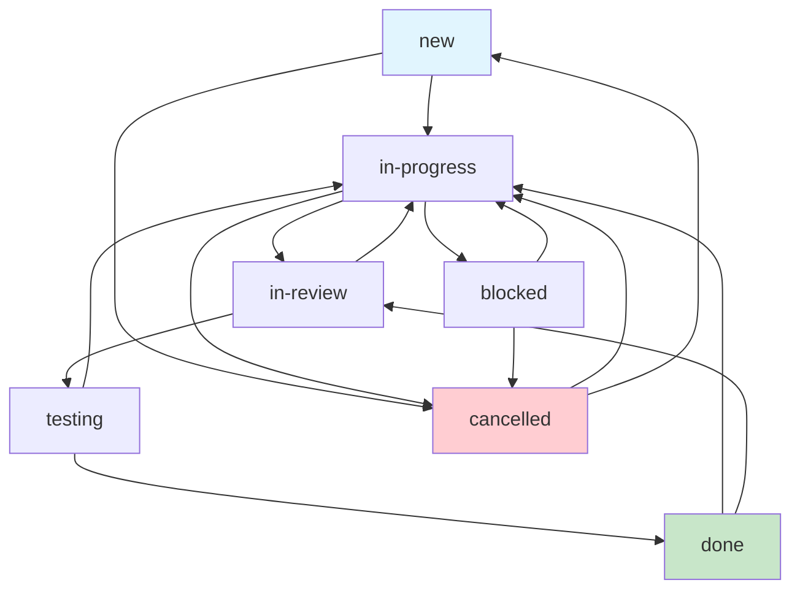

# Devlog Status Workflow Guide

**Version**: 1.0  
**Created**: July 18, 2025  
**Updated**: July 30, 2025

## Overview

This document explains the devlog status system, providing guidance on when to use each status and how they fit into typical development workflows. Understanding these statuses helps ensure consistent project tracking across teams and AI agents.

**Note**: As of v0.0.1, status transition restrictions have been removed to provide maximum workflow flexibility. Teams can transition between any statuses as their workflow requires.

## Status Categories

### Open Statuses (Active Work)
- `new` - Ready to start
- `in-progress` - Actively being developed  
- `blocked` - Temporarily stopped
- `in-review` - Awaiting review/approval
- `testing` - Being validated through testing

### Closed Statuses (Completed Work)
- `done` - Successfully completed
- `cancelled` - Abandoned/deprioritized

## Typical Workflow Progression

**Flexible Status Transitions**: Any status can transition to any other status to support diverse workflows.

*Note: While any transition is allowed, the above shows common patterns.*

## Status Definitions & Usage

### `new` - Work Ready to Start
**When to use:**
- Creating a new devlog entry
- Work item is defined but not yet started
- Task is in backlog waiting to be picked up

**Who sets it:**
- Anyone creating new work items
- Project managers organizing backlog
- AI agents discovering new work

**Next steps:**
- Move to `in-progress` when starting work
- Move to `cancelled` if deprioritized

### `in-progress` - Active Development
**When to use:**
- Starting implementation work
- Actively writing code or making changes
- Main development phase

**Who sets it:**
- Developer/AI starting work
- When resuming from `blocked` status

**Next steps:**
- Move to `in-review` when ready for review
- Move to `blocked` if stuck on dependencies
- Move to `testing` if no review needed

### `blocked` - Temporarily Stopped
**When to use:**
- Waiting for external dependencies
- Need clarification or decisions
- Cannot proceed due to other work

**Who sets it:**
- Developer/AI encountering blockers
- When dependencies become unavailable

**Examples:**
- Waiting for API documentation
- Need design approval before proceeding
- Blocked by another team's work

**Next steps:**
- Move to `in-progress` when blockers resolved
- Move to `cancelled` if permanently blocked

### `in-review` - Awaiting Review/Approval
**When to use:**
- Implementation complete, needs human review
- Pull request submitted for code review
- Design needs stakeholder approval
- Work ready for quality check

**Who sets it:**
- Developer/AI completing implementation
- When submitting for review

**Focus areas:**
- Code quality and standards
- Architecture and design decisions
- Security and best practices
- Requirements compliance

**Next steps:**
- Move to `testing` when review approved
- Move to `in-progress` if changes needed
- Move to `done` if no testing required

### `testing` - Being Validated
**When to use:**
- Work passed review, ready for testing
- Deployed to staging environment
- Running automated test suites
- User acceptance testing in progress

**Who sets it:**
- QA team starting testing
- Developer deploying to staging
- AI agent running test suites

**Testing types:**
- Functional testing
- Integration testing
- User acceptance testing
- Performance testing

**Next steps:**
- Move to `done` when tests pass
- Move to `in-progress` if issues found

### `done` - Successfully Completed
**When to use:**
- All requirements met and verified
- Feature deployed and working
- Bug fixed and confirmed
- Work delivered successfully

**Who sets it:**
- QA team after successful testing
- Developer after verification
- Product owner after acceptance

**Criteria:**
- Meets all acceptance criteria
- Passes all required tests
- Deployed/delivered successfully
- Stakeholders satisfied

### `cancelled` - Work Abandoned
**When to use:**
- Requirements changed significantly
- Work no longer needed
- Permanently deprioritized
- Superseded by other work

**Who sets it:**
- Product owner changing priorities
- Developer recommending cancellation
- Stakeholder deciding to abandon

**Note:** Different from `done` - represents work that was stopped rather than completed.

## Best Practices

### Status Transitions
1. **Always add notes** when changing status to explain the reason
2. **Update context** when moving to `blocked` (explain the blocker)
3. **Document decisions** when moving to `cancelled`
4. **Include test results** when moving from `testing`

### AI Agent Guidelines
- Use `discover_related_devlogs` before creating `new` entries
- Automatically move to `in-progress` when starting work
- Move to `blocked` when encountering external dependencies
- Include detailed notes for status changes

### Team Coordination
- Check `blocked` items regularly for resolution
- Review `in-review` items promptly to avoid bottlenecks
- Coordinate `testing` phases to avoid environment conflicts
- Celebrate `done` items in team updates

## Common Anti-Patterns

❌ **Avoid these practices:**
- Skipping `in-review` for significant changes
- Leaving items in `blocked` without follow-up
- Moving directly from `new` to `testing`
- Using `cancelled` for temporary stops (use `blocked`)
- Forgetting to update status when work resumes

## Integration with Tools

### GitHub Issues
- Open statuses map to GitHub "open" state
- Closed statuses map to GitHub "closed" state
- Status labels sync with GitHub labels

### Time Tracking
- Time calculations use status transition timestamps
- `closedAt` field set when moving to `done` or `cancelled`
- Open duration calculated from creation to closure

### Statistics
- Dashboard charts track status distributions
- Velocity calculated from status transitions
- Burndown charts use `done`/`cancelled` transitions

---

**Related**: [Core Types](../../packages/core/src/types/core.ts) | [Filter Mapping](../../packages/core/src/utils/filter-mapping.ts)
