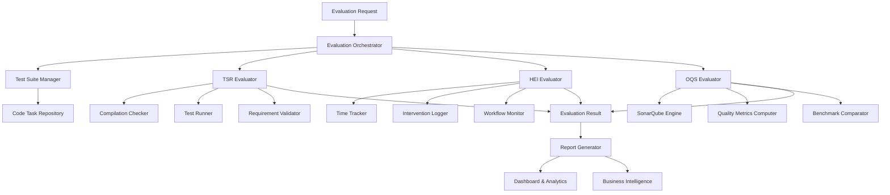

# AI Coding Agent Quantitative Evaluation System - Design Specification

**Status**: In Progress (Design Phase)  
**Target Version**: v3.0.0  
**Created**: July 21, 2025  
**Devlog Entry**: #198

## Executive Summary

The AI Coding Agent Quantitative Evaluation System provides objective, data-driven assessment of AI coding assistants using a three-dimensional scoring framework. This system addresses the critical need for standardized evaluation metrics in the rapidly growing AI coding tools market, enabling organizations to make informed decisions about tool selection, measure ROI, and optimize AI-human collaboration workflows.

## Requirements Specification

### Problem Statement

The rapid proliferation of AI coding assistants has created a critical gap in standardized evaluation methods. Current assessment approaches suffer from:

- **Subjective Bias**: Heavy reliance on anecdotal evidence and personal preferences
- **Inconsistent Metrics**: Lack of standardized measurement frameworks across tools
- **Limited Business Intelligence**: Difficulty quantifying productivity gains and ROI
- **Vendor Claims**: No independent verification of marketing performance claims
- **Integration Challenges**: Unclear guidelines for optimizing AI-human collaboration

### User Stories & Use Cases

#### Primary Use Cases

**UC-1**: **Vendor Evaluation** - Engineering Manager wants to objectively compare AI coding tools using standardized metrics so that procurement decisions are data-driven rather than based on marketing claims.

**UC-2**: **ROI Measurement** - Development Team Lead wants to quantify productivity improvements from AI assistance so that budget allocation and tool investment can be justified with concrete metrics.

**UC-3**: **Performance Optimization** - Senior Developer wants to identify specific scenarios where AI tools excel or struggle so that team workflows can be optimized for maximum efficiency.

**UC-4**: **Quality Assurance** - Tech Lead wants to assess code quality impact of AI-generated code so that technical debt and security risks can be managed proactively.

#### Edge Cases & Error Scenarios

**EC-1**: **Compilation Failures** - How to handle tasks where AI generates syntactically invalid code
**EC-2**: **Partial Solutions** - How to score incomplete implementations that meet some but not all requirements
**EC-3**: **Performance Variations** - How to account for AI performance fluctuations across evaluation sessions
**EC-4**: **Domain Specificity** - How to ensure fair evaluation across different programming domains and complexity levels

### Functional Requirements

**FR-1**: System must evaluate AI coding performance using three-dimensional scoring (TSR, HEI, OQS)
**FR-2**: System must support standardized test suites across multiple programming languages
**FR-3**: System must integrate with SonarQube for automated code quality assessment
**FR-4**: System must provide real-time evaluation capabilities during AI coding sessions
**FR-5**: System must generate comparative reports across different AI tools and timeframes
**FR-6**: System must maintain audit trails of all evaluations for reproducibility
**FR-7**: System must support task complexity classification (Simple, Medium, Complex)
**FR-8**: System must track human intervention time and effort accurately

### Non-Functional Requirements

**Performance**: Evaluation completion within 30 seconds for simple tasks, 2 minutes for complex tasks
**Scalability**: Support for 1000+ concurrent evaluations, 10,000+ test cases in repository
**Reliability**: 99.9% evaluation accuracy, <0.1% false positive rate on quality assessments
**Security**: Secure handling of proprietary code samples, encrypted evaluation data storage
**Usability**: Intuitive dashboard interface, automated report generation, API-first design
**Maintainability**: Modular architecture, comprehensive test coverage, clear documentation

### Success Criteria

- [ ] **Evaluation Accuracy**: 95%+ correlation with expert developer assessments
- [ ] **Performance Benchmarks**: Complete evaluation cycles within specified time limits
- [ ] **Quality Standards**: All generated code assessed using industry-standard metrics
- [ ] **User Adoption**: 80%+ user satisfaction rating from beta testing program
- [ ] **Business Value**: Demonstrable ROI measurement capabilities for organizations

## Solution Design Specification

### Design Overview

The AI Coding Agent Quantitative Evaluation System employs a three-dimensional assessment model that balances immediate usability (TSR), efficiency gains (HEI), and long-term maintainability (OQS). The architecture follows a modular design with separate evaluation engines unified through a central orchestration platform, providing both real-time assessment capabilities and comprehensive analytical reporting.

### Architecture Components

#### Core Components

```typescript
// Primary evaluation orchestrator
interface EvaluationOrchestrator {
  // Coordinate evaluation across all three dimensions
  evaluateAIPerformance(task: CodeTask, aiOutput: AICodeOutput): Promise<EvaluationResult>;

  // Manage evaluation sessions and context
  createEvaluationSession(config: SessionConfig): Promise<EvaluationSession>;

  // Generate comprehensive reports
  generateReport(sessions: EvaluationSession[]): Promise<EvaluationReport>;
}

// Task Success Rate evaluation engine
interface TSREvaluator {
  // Core TSR assessment functionality
  evaluateTaskSuccess(task: CodeTask, output: AICodeOutput): Promise<TSRResult>;

  // Validate compilation and syntax
  validateCompilation(code: string, language: string): Promise<CompilationResult>;

  // Execute test cases
  runTestCases(code: string, testCases: TestCase[]): Promise<TestResults>;

  // Verify functional completeness
  verifyRequirements(
    output: AICodeOutput,
    requirements: TaskRequirement[],
  ): Promise<RequirementValidation>;
}

// Human Effort Index measurement system
interface HEIEvaluator {
  // Measure human intervention requirements
  calculateEffortIndex(aiTime: number, humanTime: number): Promise<HEIResult>;

  // Track intervention categories
  categorizeInterventions(modifications: CodeModification[]): Promise<InterventionAnalysis>;

  // Monitor workflow patterns
  analyzeWorkflowEfficiency(session: EvaluationSession): Promise<WorkflowAnalysis>;
}

// Output Quality Score assessment platform
interface OQSEvaluator {
  // Comprehensive quality assessment
  assessCodeQuality(code: string, language: string): Promise<OQSResult>;

  // SonarQube integration
  runQualityAnalysis(codebase: string): Promise<SonarQubeResults>;

  // Industry benchmarking
  compareAgainstStandards(metrics: QualityMetrics): Promise<BenchmarkComparison>;
}

// Test suite management system
interface TestSuiteManager {
  // Standardized task repository
  getTasksByComplexity(level: ComplexityLevel): Promise<CodeTask[]>;

  // Domain-specific test cases
  getTasksByDomain(domain: ProgrammingDomain): Promise<CodeTask[]>;

  // Task validation and calibration
  validateTaskDifficulty(task: CodeTask): Promise<TaskValidation>;

  // Dynamic test case generation
  generateTestCases(requirements: TaskRequirement[]): Promise<TestCase[]>;
}

// Data models for evaluation framework
interface CodeTask {
  id: string;
  title: string;
  description: string;
  requirements: TaskRequirement[];
  complexity: ComplexityLevel;
  domain: ProgrammingDomain;
  language: ProgrammingLanguage;
  estimatedTimeMinutes: number;
  testCases: TestCase[];
  sampleSolution?: string;
  qualityBaseline?: QualityMetrics;
}

interface AICodeOutput {
  code: string;
  explanation?: string;
  generationTime: number;
  contextTokens?: number;
  confidence?: number;
  metadata: {
    model: string;
    temperature?: number;
    timestamp: string;
  };
}

interface EvaluationResult {
  taskId: string;
  sessionId: string;
  timestamp: string;

  // Three-dimensional scores
  tsr: TSRResult;
  hei: HEIResult;
  oqs: OQSResult;

  // Aggregate scoring
  overallScore: number; // Weighted combination
  recommendation: 'excellent' | 'good' | 'fair' | 'poor' | 'unacceptable';

  // Additional context
  humanInterventions: InterventionRecord[];
  qualityIssues: QualityIssue[];
  performanceMetrics: PerformanceMetrics;
}
```

#### Component Interactions



### Data Design

#### Core Data Models

```typescript
// Task Success Rate (TSR) Data Models
interface TSRResult {
  taskId: string;
  timestamp: string;

  // Primary metric
  successRate: number; // 0-100%

  // Component assessments
  compilationSuccess: boolean;
  testCaseResults: TestCaseResult[];
  requirementsFulfillment: RequirementResult[];

  // Success categorization
  rating: 'excellent' | 'good' | 'fair' | 'poor' | 'unacceptable';

  // Detailed analysis
  failureReasons?: string[];
  partialImplementations?: string[];
  qualityGaps?: string[];
}

interface TestCaseResult {
  testId: string;
  passed: boolean;
  expectedOutput: any;
  actualOutput: any;
  executionTime: number;
  errorMessage?: string;
}

// Human Effort Index (HEI) Data Models
interface HEIResult {
  taskId: string;
  timestamp: string;

  // Primary metric
  effortIndex: number; // 0.0-1.0 (human effort / total effort)

  // Time measurements
  aiGenerationTime: number; // seconds
  humanModificationTime: number; // seconds
  totalTime: number;

  // Efficiency analysis
  efficiencyGain: number; // Percentage improvement over manual coding
  interventionType: InterventionType[];
  complexityFactor: number;

  // Workflow insights
  iterationCount: number;
  contextSwitches: number;
  debuggingTime: number;
}

interface InterventionRecord {
  id: string;
  timestamp: string;
  type: InterventionType;
  duration: number;
  description: string;
  codeChangeSize: 'minimal' | 'moderate' | 'substantial' | 'complete-rewrite';
  category: 'syntax' | 'logic' | 'performance' | 'security' | 'style' | 'requirements';
}

// Output Quality Score (OQS) Data Models
interface OQSResult {
  taskId: string;
  timestamp: string;

  // Primary metric
  qualityScore: number; // 0-100 (weighted combination)
  qualityGrade: 'A' | 'B' | 'C' | 'D' | 'E';

  // Quality dimensions
  reliability: QualityDimensionScore;
  security: QualityDimensionScore;
  maintainability: QualityDimensionScore;
  testCoverage: QualityDimensionScore;
  duplicationControl: QualityDimensionScore;

  // SonarQube integration
  sonarQubeResults: SonarQubeAnalysis;

  // Industry benchmarking
  industryComparison: BenchmarkComparison;
}

interface QualityDimensionScore {
  score: number; // 0-100
  weight: number; // Contribution to overall score
  issues: QualityIssue[];
  recommendations: string[];
}

interface SonarQubeAnalysis {
  projectKey: string;
  analysisDate: string;
  qualityGate: 'PASSED' | 'FAILED';
  measures: {
    bugs: number;
    vulnerabilities: number;
    codeSmells: number;
    coverage: number;
    duplicatedLines: number;
    technicalDebt: string; // e.g., "2h 30min"
  };
  issues: SonarQubeIssue[];
}
```

#### Database Schema

```sql
-- Evaluation sessions and results
CREATE TABLE evaluation_sessions (
    id UUID PRIMARY KEY DEFAULT gen_random_uuid(),
    name VARCHAR(255) NOT NULL,
    description TEXT,
    ai_model VARCHAR(100) NOT NULL,
    evaluation_config JSONB NOT NULL,
    created_at TIMESTAMPTZ DEFAULT NOW(),
    updated_at TIMESTAMPTZ DEFAULT NOW(),
    completed_at TIMESTAMPTZ,
    status evaluation_status DEFAULT 'pending'
);

CREATE TYPE evaluation_status AS ENUM ('pending', 'running', 'completed', 'failed');

-- Task repository
CREATE TABLE code_tasks (
    id UUID PRIMARY KEY DEFAULT gen_random_uuid(),
    title VARCHAR(500) NOT NULL,
    description TEXT NOT NULL,
    requirements JSONB NOT NULL,
    complexity complexity_level NOT NULL,
    domain programming_domain NOT NULL,
    language programming_language NOT NULL,
    estimated_time_minutes INTEGER,
    test_cases JSONB NOT NULL,
    sample_solution TEXT,
    quality_baseline JSONB,
    created_at TIMESTAMPTZ DEFAULT NOW(),
    validated_at TIMESTAMPTZ,
    validation_score NUMERIC(3,2)
);

CREATE TYPE complexity_level AS ENUM ('simple', 'medium', 'complex');
CREATE TYPE programming_domain AS ENUM ('algorithms', 'web-development', 'data-processing', 'system-tools', 'specialized');
CREATE TYPE programming_language AS ENUM ('javascript', 'typescript', 'python', 'java', 'csharp', 'cpp', 'rust', 'go');

-- Evaluation results
CREATE TABLE evaluation_results (
    id UUID PRIMARY KEY DEFAULT gen_random_uuid(),
    session_id UUID REFERENCES evaluation_sessions(id),
    task_id UUID REFERENCES code_tasks(id),
    ai_output JSONB NOT NULL,
    tsr_result JSONB NOT NULL,
    hei_result JSONB NOT NULL,
    oqs_result JSONB NOT NULL,
    overall_score NUMERIC(5,2),
    recommendation evaluation_recommendation,
    created_at TIMESTAMPTZ DEFAULT NOW()
);

CREATE TYPE evaluation_recommendation AS ENUM ('excellent', 'good', 'fair', 'poor', 'unacceptable');

-- Performance indexes
CREATE INDEX idx_evaluation_results_session ON evaluation_results(session_id);
CREATE INDEX idx_evaluation_results_task ON evaluation_results(task_id);
CREATE INDEX idx_evaluation_results_score ON evaluation_results(overall_score);
CREATE INDEX idx_code_tasks_complexity ON code_tasks(complexity);
CREATE INDEX idx_code_tasks_domain ON code_tasks(domain);
```

### API Design

#### Public Interface (REST API)

```typescript
// Evaluation Management
POST / api / v1 / evaluations; // Create new evaluation session
GET / api / v1 / evaluations; // List evaluation sessions
GET / api / v1 / evaluations / { id }; // Get evaluation session details
PUT / api / v1 / evaluations / { id }; // Update evaluation session
DELETE / api / v1 / evaluations / { id }; // Delete evaluation session

// Task Management
GET / api / v1 / tasks; // List available tasks (with filtering)
GET / api / v1 / tasks / { id }; // Get task details
POST / api / v1 / tasks; // Create custom task
PUT / api / v1 / tasks / { id }; // Update task
DELETE / api / v1 / tasks / { id }; // Delete task

// Evaluation Execution
POST / api / v1 / evaluations / { id } / execute; // Execute evaluation session
GET / api / v1 / evaluations / { id } / results; // Get evaluation results
POST / api / v1 / evaluations / { id } / results / { taskId } / rerun; // Re-run specific task

// Reporting & Analytics
GET / api / v1 / reports / summary; // Get evaluation summary
GET / api / v1 / reports / comparison; // Compare multiple evaluations
GET / api / v1 / reports / trends; // Get trend analysis
POST / api / v1 / reports / custom; // Generate custom report

// Quality Integration
POST / api / v1 / quality / analyze; // Analyze code quality
GET / api / v1 / quality / benchmarks; // Get industry benchmarks
```

#### Internal Service Interfaces

```typescript
// Service layer interfaces for modular architecture
interface EvaluationService {
  createSession(config: SessionConfig): Promise<EvaluationSession>;
  executeEvaluation(sessionId: string, taskIds: string[]): Promise<EvaluationResults>;
  getResults(sessionId: string, filters?: ResultFilters): Promise<EvaluationResult[]>;
  generateReport(sessionId: string, reportType: ReportType): Promise<Report>;
}

interface TaskService {
  getTasks(filters: TaskFilters): Promise<CodeTask[]>;
  createTask(task: CreateTaskRequest): Promise<CodeTask>;
  validateTask(taskId: string): Promise<TaskValidation>;
  calibrateComplexity(taskId: string): Promise<ComplexityAssessment>;
}

interface QualityService {
  analyzeCode(code: string, language: string): Promise<QualityAnalysis>;
  runSonarQube(projectPath: string): Promise<SonarQubeResults>;
  getBenchmarks(domain: string, language: string): Promise<QualityBenchmarks>;
}

interface TimeTrackingService {
  startSession(sessionId: string, taskId: string): Promise<TrackingSession>;
  recordEvent(sessionId: string, event: TrackingEvent): Promise<void>;
  calculateMetrics(sessionId: string): Promise<TimeMetrics>;
}
```

## Implementation Strategy

### Phase 1: Core Infrastructure (Weeks 1-4)

**Objectives**: Establish foundational architecture and basic evaluation capabilities

**Deliverables**:

- [ ] Core data models and database schema
- [ ] Basic TSR evaluation engine with compilation checking
- [ ] Simple test case execution framework
- [ ] Time tracking infrastructure for HEI calculation
- [ ] REST API foundation with authentication

**Technical Milestones**:

- [ ] Database migrations for evaluation schema
- [ ] TypeScript interfaces for all core models
- [ ] Basic Docker containerization for isolated code execution
- [ ] Authentication and authorization framework
- [ ] API documentation with OpenAPI specification

### Phase 2: Quality Integration (Weeks 5-8)

**Objectives**: Integrate comprehensive code quality assessment capabilities

**Deliverables**:

- [ ] SonarQube integration with automated project creation
- [ ] OQS evaluation engine with weighted scoring
- [ ] Industry benchmark database with initial datasets
- [ ] Quality issue categorization and reporting
- [ ] Security vulnerability assessment integration

**Technical Milestones**:

- [ ] SonarQube API client with project lifecycle management
- [ ] Quality metrics calculation engine
- [ ] Benchmark comparison algorithms
- [ ] Security scanning pipeline integration
- [ ] Performance testing framework for quality tools

### Phase 3: Advanced Analytics (Weeks 9-12)

**Objectives**: Build comprehensive reporting and business intelligence capabilities

**Deliverables**:

- [ ] Interactive dashboard with real-time evaluation monitoring
- [ ] Comparative analysis across multiple AI tools
- [ ] Trend analysis and performance optimization recommendations
- [ ] Custom report generation with templating
- [ ] Export capabilities (PDF, Excel, JSON)

**Technical Milestones**:

- [ ] React-based dashboard with charting library integration
- [ ] Data visualization components for three-dimensional scoring
- [ ] Report templating engine with customizable layouts
- [ ] Background job processing for large-scale evaluations
- [ ] Caching layer for performance optimization

### Phase 4: Production Readiness (Weeks 13-16)

**Objectives**: Ensure system scalability, reliability, and enterprise-grade features

**Deliverables**:

- [ ] Comprehensive test suite with >90% coverage
- [ ] Performance optimization for concurrent evaluations
- [ ] Enterprise features (SSO, audit logs, compliance)
- [ ] Documentation and training materials
- [ ] Deployment automation and monitoring

**Technical Milestones**:

- [ ] Load testing with 1000+ concurrent evaluations
- [ ] High availability setup with database clustering
- [ ] Security audit and penetration testing
- [ ] API rate limiting and abuse protection
- [ ] Comprehensive monitoring and alerting

## Risk Assessment and Mitigation

### Technical Risks

**Risk**: **SonarQube Integration Complexity**

- **Probability**: Medium
- **Impact**: High
- **Description**: SonarQube setup and API integration may be more complex than anticipated
- **Mitigation**:
  - Start with Docker-based SonarQube deployment for simplified setup
  - Implement fallback quality metrics using static analysis tools
  - Allocate buffer time for integration debugging

**Risk**: **Code Execution Security Vulnerabilities**

- **Probability**: High
- **Impact**: Critical
- **Description**: Executing untrusted AI-generated code poses security risks
- **Mitigation**:
  - Use containerized execution environments with strict resource limits
  - Implement comprehensive input sanitization and code scanning
  - Use VM-based isolation for high-risk evaluations
  - Regular security audits of execution environment

**Risk**: **Performance Scalability Issues**

- **Probability**: Medium
- **Impact**: High
- **Description**: System may not handle concurrent evaluations at target scale
- **Mitigation**:
  - Design asynchronous evaluation processing from the start
  - Implement horizontal scaling with container orchestration
  - Use database read replicas for reporting queries
  - Performance testing throughout development

### Business Risks

**Risk**: **Market Adoption Challenges**

- **Probability**: Medium
- **Impact**: High
- **Description**: Organizations may be hesitant to adopt new evaluation frameworks
- **Mitigation**:
  - Start with pilot programs and case studies
  - Integrate with existing development tools and workflows
  - Provide clear ROI demonstration through beta testing
  - Build partnerships with AI tool vendors for validation

**Risk**: **Competitive Response from Established Players**

- **Probability**: High
- **Impact**: Medium
- **Description**: Existing AI tool vendors may develop competing evaluation systems
- **Mitigation**:
  - Focus on open standards and vendor-neutral approach
  - Build strong community around evaluation methodology
  - Continuous innovation in evaluation techniques
  - Strategic partnerships with enterprise customers

## Validation Framework

### Design Validation

#### Assumptions to Validate

**A1**: **Three-dimensional scoring provides more accurate assessment than single metrics**

- **Validation Method**: Correlation analysis with expert developer assessments
- **Success Criteria**: >90% correlation with manual evaluation results
- **Timeline**: Weeks 2-3 of Phase 1

**A2**: **SonarQube integration provides sufficient quality assessment coverage**

- **Validation Method**: Comparison with manual code review results
- **Success Criteria**: >85% agreement on quality issues identification
- **Timeline**: Weeks 1-2 of Phase 2

**A3**: **Time-based HEI calculation accurately reflects productivity impact**

- **Validation Method**: Side-by-side comparison with traditional development workflows
- **Success Criteria**: Demonstrable correlation with actual productivity metrics
- **Timeline**: Weeks 2-4 of Phase 1

#### Validation Methods

**Prototype Testing**:

- Build minimal viable evaluation engine for top 3 programming languages
- Test with 50+ code tasks across complexity levels
- Validate scoring accuracy against expert assessments

**User Research**:

- Conduct interviews with 20+ development teams
- Survey engineering managers on evaluation criteria importance
- Gather feedback on dashboard usability and report usefulness

**Technical Proof of Concept**:

- Demonstrate end-to-end evaluation pipeline
- Validate SonarQube integration with real codebases
- Test system performance under simulated load

## Testing Strategy

### Unit Testing

**Component Tests**:

- TSR Evaluator: Test compilation checking, test execution, requirement validation
- HEI Evaluator: Test time tracking accuracy, intervention categorization
- OQS Evaluator: Test quality metric calculation, benchmark comparison

**Service Tests**:

- Evaluation orchestration workflow validation
- API endpoint functionality and error handling
- Database operations and data integrity

**Integration Tests**:

- SonarQube API integration reliability
- Container execution environment security
- Multi-language evaluation pipeline

### User Acceptance Testing

**Test Scenarios**:

- Complete evaluation session for JavaScript React component
- Comparative analysis between two AI tools
- Custom report generation with filtering and export

**Acceptance Criteria**:

- Evaluation completion within performance benchmarks
- Accurate scoring across all three dimensions
- Intuitive user interface with minimal training required

**Performance Benchmarks**:

- Simple tasks: <30 seconds evaluation time
- Complex tasks: <2 minutes evaluation time
- Dashboard load: <3 seconds for 100+ results

## Success Metrics

### Quantitative Metrics

**Performance**:

- Evaluation completion time: 95% within benchmarks
- System availability: >99.9% uptime
- API response time: <500ms for 95% of requests

**Usage**:

- Monthly active evaluations: Target 1000+ within 6 months
- User engagement: >70% weekly active usage among registered teams
- API adoption: >100 external integrations within first year

**Quality**:

- Evaluation accuracy: >95% correlation with expert assessments
- False positive rate: <5% on quality issue detection
- User-reported bugs: <10 per month in production

### Qualitative Metrics

**User Satisfaction**:

- Net Promoter Score: Target >50 among enterprise users
- Customer support tickets: <2% of total evaluations
- Feature request fulfillment: >80% within quarterly releases

**Developer Experience**:

- API documentation rating: >4.5/5 stars
- Integration setup time: <30 minutes for basic configuration
- Learning curve: <2 hours to productive usage

**Maintainability**:

- Code coverage: >90% across all modules
- Technical debt ratio: <5% according to SonarQube analysis
- Documentation completeness: 100% API coverage, 90% implementation details

---

## Next Steps

This design specification provides the foundation for implementing a comprehensive AI coding evaluation system. The next phase should focus on:

1. **Stakeholder Review**: Present design to development teams and management for feedback
2. **Technology Validation**: Build proof-of-concept prototypes for critical components
3. **Resource Planning**: Finalize development team allocation and timeline commitments
4. **Risk Mitigation**: Begin addressing high-priority technical and business risks
5. **Architecture Refinement**: Iterate on design based on stakeholder input and technical discoveries

The goal is to create a system that not only measures AI coding performance accurately but also provides actionable insights for improving development workflows and maximizing the value of AI-human collaboration.
