# AI Agent Observability - Project Overview

**Started**: January 15, 2025  
**Current Status**: Core infrastructure complete, integration needed  
**Overall Progress**: ~40-45% complete (as of Nov 2, 2025)  
**Status**: 🚧 Active Development

## Vision

Transform devlog into a comprehensive AI coding agent observability platform that provides complete visibility into AI agent activities, enabling developers and organizations to understand, optimize, and measure the impact of AI-assisted development.

## Architecture

**Hybrid TypeScript + Go Architecture**

- **TypeScript**: Web UI, MCP Server, API Gateway, Business Logic
- **Go**: Client-side collector (~10-20MB binary), Event processing, Real-time streaming, Analytics

**Rationale**: Balance rapid development (TypeScript) with high performance (Go) where it matters most.

---

## Current Progress by Phase

### Phase 0: Go Collector Infrastructure ✅ **65% COMPLETE**

**Target**: Production-ready collector binary  
**Progress**: 65% (Core infrastructure done)  
**Priority**: High - Fix test failures and backend integration

**Purpose**: Lightweight binary that runs on developer machines to capture AI agent logs in real-time.

**✅ Completed (Core Infrastructure)**:

- ✅ Project structure and Go module setup (39 Go files)
- ✅ CLI with Cobra (start/status/version commands)
- ✅ Cross-platform build system (Makefile, build scripts)
- ✅ Configuration system (81.2% test coverage)
- ✅ File watcher with fsnotify (75.3% coverage)
- ✅ SQLite buffer for offline support
- ✅ Copilot adapter complete (78.6% coverage)
- ✅ HTTP client with retry logic
- ✅ Hierarchy resolution (43.2% coverage)
- ✅ Binary builds successfully (~15MB)

**� In Progress (Priority)**:

- 🔨 Fix failing tests (buffer, client, integration)
- 🔨 End-to-end integration testing
- 🔨 Backend communication validation
- 🔨 Historical backfill system (0% coverage) - Import existing logs

**⏳ Deferred (Low Priority)**:

- ⏸️ Additional adapters (Claude, Cursor) - Nice to have
- ⏸️ NPM distribution - Not needed now

📄 **Detailed Plan**: [GO_COLLECTOR_ROADMAP.md](./GO_COLLECTOR_ROADMAP.md)

---

### Phase 1: Foundation (Weeks 1-4) ✅ **85% COMPLETE**

**Progress**: 85% complete  
**Status**: Core complete, API endpoints needed

#### ✅ Week 1-2: Core Services (100%)

- [x] Database schema with TimescaleDB hypertables
- [x] TypeScript type definitions
- [x] Prisma schema and migrations
- [x] AgentEventService implementation (~600 LOC)
- [x] AgentSessionService implementation (~600 LOC)
- [x] Event context enrichment (git, files, project)
- [x] Unit tests (~2,142 LOC total)

#### ✅ Week 3-4: Web UI (100%)

- [x] 16 React components built
- [x] Sessions page (`/sessions`)
- [x] Session details page (`/sessions/[id]`)
- [x] Dashboard with active sessions
- [x] Hierarchy navigation UI
- [x] Real-time activity widgets

#### 🚧 Critical Gap: API Layer (0%)

**Priority: HIGH** - Needed for frontend-backend integration

- [ ] Create `/api/sessions` endpoints
- [ ] Create `/api/events` endpoints
- [ ] Implement real-time streaming
- [ ] Connect frontend to real APIs (currently using mock data)

#### ⏸️ Deferred: Performance & MCP

- [ ] TimescaleDB continuous aggregates (Week 3 - deferred)
- [ ] MCP integration with services (low priority)
- [ ] Advanced filtering and pagination (nice to have)

---

### Phase 2: Visualization (Weeks 5-8) 📅 **PLANNED**

**Progress**: 0%  
**Start Date**: After Phase 0 complete

**Key Deliverables**:

- Session management dashboard
- Interactive event timeline
- Real-time activity monitoring
- Search and filtering capabilities

**Status**: Design complete, implementation pending

---

### Phase 3: Intelligence (Weeks 9-12) 📅 **PLANNED**

**Progress**: 0%

**Key Deliverables**:

- Pattern recognition system
- Code quality analysis integration
- Recommendation engine
- Comparative analytics
- Automated reporting

**Status**: Design complete, implementation pending

---

### Phase 4: Enterprise (Weeks 13-16) 📅 **PLANNED**

**Progress**: 0%

**Key Deliverables**:

- Team collaboration features
- Compliance and audit trails
- Third-party integrations (GitHub, Jira, Slack)
- Public API with authentication
- SSO and RBAC

**Status**: Design complete, implementation pending

---

## Overall Project Metrics

| Metric                    | Target   | Current       | Status      |
| ------------------------- | -------- | ------------- | ----------- |
| **Backend Services**      | Complete | ✅ 2,142 LOC  | ✅ Complete |
| **Frontend Components**   | Complete | ✅ 16 files   | ✅ Complete |
| **Go Collector**          | Working  | ✅ 39 files   | 🔨 85% done |
| **API Endpoints**         | Complete | ❌ 0 routes   | ⏳ Needed   |
| **Integration Tests**     | Passing  | ⚠️ Some fail  | 🔨 In work  |
| **Collector Binary Size** | <20MB    | ✅ ~15MB      | ✅ Good     |
| **End-to-End Flow**       | Working  | ❌ Not tested | ⏳ Critical |

---

## Technology Stack

### Backend Services

- **TypeScript/Node.js**: API Gateway, MCP Server, Web UI
- **Go**: Event collector, processing engine, analytics
- **PostgreSQL + TimescaleDB**: Time-series event storage (see [Database Architecture](../20251031-database-architecture/README.md))
- **SQLite**: Client-side offline buffer in Go collector
- **Redis**: Caching and pub/sub (future)

### Frontend

- **Next.js 14+**: React with App Router
- **Tailwind CSS**: Styling
- **shadcn/ui**: Component library
- **Recharts**: Data visualization

### Infrastructure

- **Docker**: Containerization
- **Docker Compose**: Local development
- **GitHub Actions**: CI/CD (planned)

---

## Key Documents

| Document                                                                                                   | Purpose                          | Audience               |
| ---------------------------------------------------------------------------------------------------------- | -------------------------------- | ---------------------- |
| [ai-agent-observability-design.md](./ai-agent-observability-design.md)                                     | Complete technical specification | Engineers              |
| [ai-agent-observability-executive-summary.md](./ai-agent-observability-executive-summary.md)               | Business case and vision         | Leadership             |
| [ai-agent-observability-quick-reference.md](./ai-agent-observability-quick-reference.md)                   | Quick start guide                | Developers             |
| [ai-agent-observability-implementation-checklist.md](./ai-agent-observability-implementation-checklist.md) | Detailed task breakdown          | Project managers       |
| [go-collector-design.md](./go-collector-design.md)                                                         | Go collector architecture        | Go developers          |
| [GO_COLLECTOR_ROADMAP.md](./GO_COLLECTOR_ROADMAP.md)                                                       | 20-day implementation plan       | Development team       |
| [ai-agent-observability-performance-analysis.md](./ai-agent-observability-performance-analysis.md)         | Language performance comparison  | Architects             |
| [Database Architecture](../20251031-database-architecture/README.md)                                       | PostgreSQL + TimescaleDB design  | Engineers & Architects |

---

## Critical Path

```mermaid
graph TB
    subgraph Current["✅ Completed Infrastructure"]
        Backend["Backend Services<br/>AgentEventService<br/>AgentSessionService<br/>~2,142 LOC"]
        Frontend["Frontend UI<br/>16 Components<br/>Sessions + Dashboard"]
        Collector["Go Collector<br/>39 files<br/>Copilot adapter working"]
    end

    subgraph Critical["🔥 Critical Next Steps (Week 1)"]
        API["API Endpoints<br/>/api/sessions<br/>/api/events"]
        Tests["Fix Tests<br/>Integration<br/>End-to-end"]
        Integration["Connect Layers<br/>Frontend → Backend<br/>Collector → Backend"]
    end

    subgraph Critical2["🔥 Also Critical (Week 1)"]
        Backfill["Historical Backfill<br/>Import existing logs<br/>Bulk API endpoint"]
    end

    subgraph Future["⏸️ Deferred"]
        Adapters["More Adapters<br/>(Claude, Cursor)"]
        NPM["NPM Package"]
        MCP["MCP Integration"]
    end

    Backend --> API
    Frontend --> API
    Collector --> API
    Collector --> Backfill

    API --> Integration
    Tests --> Integration
    Backfill --> Integration

    Integration --> Working["✅ Working System"]

    Working -.-> Adapters
    Working -.-> NPM
    Working -.-> MCP
```

---

## Next Actions (Priority Order)

### 🔥 Critical (Week 1)

**Backend API Integration**:

1. Create `/api/sessions` REST endpoints (GET, POST, PATCH)
2. Create `/api/events` REST endpoints (GET, POST, bulk)
3. Implement real-time event streaming endpoint
4. Connect frontend components to real APIs
5. Remove mock data from frontend

**Go Collector Stabilization**:

1. Fix failing tests (buffer, client, integration)
2. Validate end-to-end flow: Collector → Backend → Database
3. Test real-time event collection with Copilot

**Historical Backfill**:

1. Implement backfill system to import existing agent logs
2. Parse historical log files and extract events
3. Bulk import API endpoint for backfill data
4. Backfill progress tracking and status

### 📋 Important (Week 2)

**Performance & Optimization**:

1. TimescaleDB continuous aggregates setup
2. Query performance benchmarking
3. Frontend pagination implementation
4. Caching strategy for dashboard

### ⏸️ Deferred (Future)

- Additional adapters (Claude, Cursor)
- NPM distribution package
- MCP service integration
- Phase 2-4 features (visualization, intelligence, enterprise)ure)

- Additional adapters (Claude, Cursor)
- NPM distribution package
- MCP service integration
- Historical backfill system
- Phase 2-4 features

---

## Risks & Mitigation

| Risk                             | Impact | Status     | Mitigation                             |
| -------------------------------- | ------ | ---------- | -------------------------------------- |
| **Missing API endpoints**        | HIGH   | ⚠️ Active  | Create REST endpoints (2-3 days)       |
| **Frontend using mock data**     | HIGH   | ⚠️ Active  | Connect to real APIs after endpoints   |
| **Test failures in collector**   | MEDIUM | 🔨 In work | Debug buffer/client/integration tests  |
| **No end-to-end validation**     | HIGH   | ⚠️ Active  | Integration testing after API complete |
| **Agent log format changes**     | LOW    | Deferred   | Version detection (future)             |
| **Cross-platform compatibility** | LOW    | ✅ Handled | Binary builds successfully             |
| **Performance overhead**         | LOW    | Deferred   | Benchmark after integration (future)   |

---

## Success Criteria

### Phase 0 (Go Collector Infrastructure)

- [x] Binary builds on all platforms (mac/linux/windows)
- [x] Binary size < 20MB (~15MB achieved)
- [x] Configuration system working
- [x] File watcher operational
- [x] SQLite buffer implemented
- [x] Copilot adapter working
- [ ] All tests passing (buffer/client/integration need fixes)
- [ ] End-to-end flow validated

### Phase 1 (Backend Integration) - CURRENT PRIORITY

- [x] Backend services complete (AgentEventService, AgentSessionService)
- [x] Frontend components complete (16 components)
- [x] Database schema with TimescaleDB
- [ ] **API endpoints created** ⚠️ CRITICAL

### Phase 1 Remaining (High Priority)

- [ ] **Historical backfill system** ⚠️ HIGH PRIORITY
  - [ ] Backfill command/API to import existing logs
  - [ ] Bulk event import endpoint
  - [ ] Progress tracking for backfill operations
  - [ ] Handle duplicate detection

### Deferred (Future Phases)

- [ ] Additional adapters (Claude, Cursor) - nice to have
- [ ] NPM distribution - not priority
- [ ] MCP integration - not priority
- [ ] Performance optimization (<100ms P95, >10K events/sec)
- [ ] Pattern detection and analytics (Phase 3)
      **Last Updated**: November 2, 2025  
      **Current Focus**: API endpoints + integration layer + historical backfill  
      **Estimated Time to Working System**: 2-3 days (API) + 1-2 days (backfill) + 1-2 days (testing)  
      **Next Review**: After API endpoints complete10K events/sec)
- [ ] Pattern detection and analytics (Phase 3)
- [ ] Enterprise features (Phase 4)

---

## Team & Resources

**Current Team**: AI-assisted development  
**Required Skills**: Go, TypeScript, React, PostgreSQL, TimescaleDB  
**Time Commitment**: ~4 months for MVP (all 4 phases)

---

**Last Updated**: November 2, 2025  
**Current Focus**: API endpoints + integration layer  
**Estimated Time to Working System**: 2-3 days (API) + 1-2 days (testing)  
**Next Review**: After API endpoints complete
